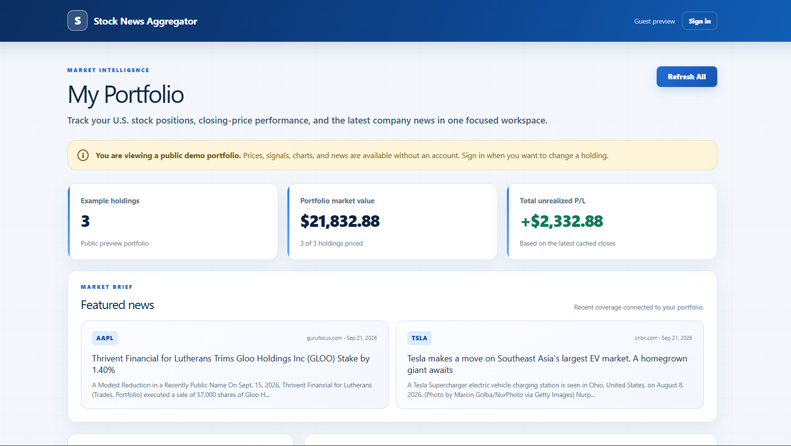
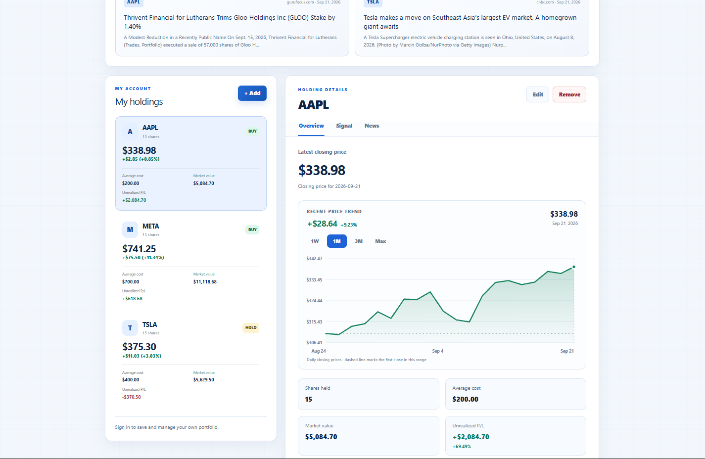
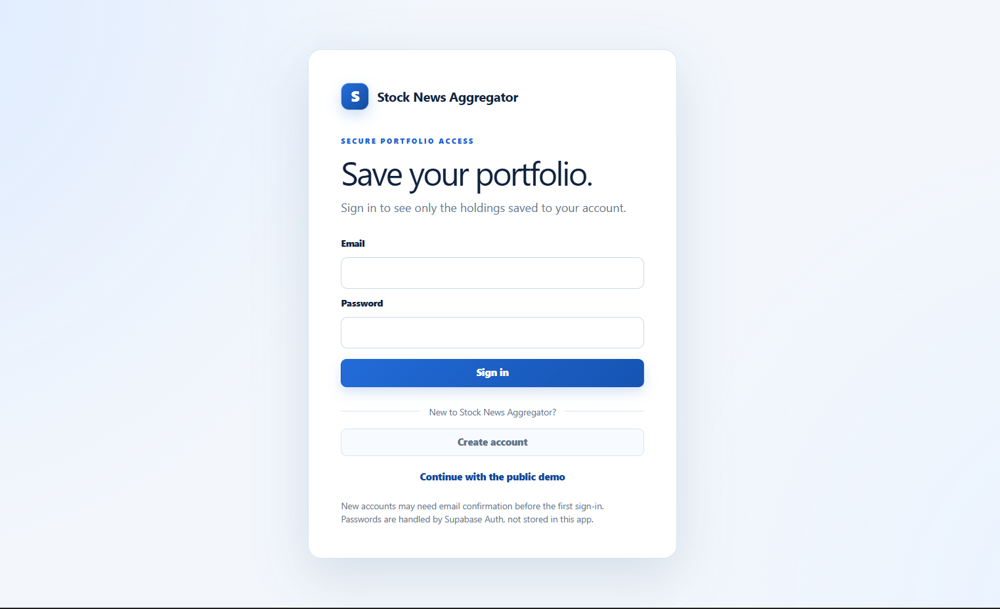

# Stock News Aggregator

A full-stack portfolio and market-news dashboard for exploring a public example portfolio or tracking account-isolated U.S. stock holdings. The application combines shared daily-price data, unrealized profit and loss, lightweight price charts, a transparent moving-average signal, and company news in one responsive interface.

This is a personal, non-commercial learning and portfolio project. It does not connect to brokerage accounts, execute trades, or provide investment advice.

## Live application

Explore the app at [stock-news-aggregator-dashboard.vercel.app](https://stock-news-aggregator-dashboard.vercel.app)


## Highlights

### See your portfolio at a glance



See your portfolio’s overall performance and recent news in one place.

- Review total market value and unrealized profit or loss.
- Read featured stories with the related stock clearly labeled.
- Start with three example holdings, then sign in to save your own portfolio.

### Follow each stock



Select any holding to open its detailed view.

- Check the latest price, recent movement, average cost, market value, and unrealized P/L.
- Switch the chart between one week, one month, three months, and all available history.
- Use the **Overview**, **Signal**, and **News** tabs to compare performance, trends, and recent coverage.
- Sign in to add, edit, remove, or refresh holdings.

### Create your own portfolio



- Sign in to return to a saved portfolio.
- Create an account to manage your own holdings.
- Continue with the example portfolio without registering.
- Keep your holdings private without connecting a brokerage account.

## Technology

- **Application:** Next.js 16 App Router, React 19, TypeScript, Tailwind CSS
- **Authentication and database:** Supabase Auth and PostgreSQL
- **Financial arithmetic:** Decimal.js
- **Market prices:** Alpha Vantage
- **Company news:** Marketaux
- **Deployment:** Vercel
- **Testing:** Node test runner through `tsx`

## Architecture

```text
Browser
  ├─ public demo or authenticated private portfolio
  ├─ authentication and portfolio forms
  ├─ Overview / Signal / News tabs
  └─ client-side news refresh while the News tab is visible
          │
          ▼
Next.js application
  ├─ Server Components load public demo data or the signed-in user's dashboard
  ├─ Server Actions add, edit, delete, and refresh positions
  ├─ /api/news protects and coordinates news refreshes
  └─ /api/prices/refresh protects scheduled price refreshes
          │
          ├──────────────► Alpha Vantage / Marketaux
          │
          ▼
Supabase
  ├─ private user-owned positions protected by RLS
  ├─ shared daily-price and refresh-status cache
  └─ shared article, symbol-link, lease, and usage tables
```

Private portfolio rows are scoped to `auth.uid()`. Guest access is read-only and limited to the three example symbols. Market prices and news are shared by symbol so multiple users do not create duplicate external API requests for the same public data.

## Repository structure

```text
.
├─ README.md                  # Public project overview
├─ docs/screenshots/          # README product screenshots
├─ web/                       # Deployable Next.js application
│  ├─ src/app/                # Pages, Server Actions, and Route Handlers
│  ├─ src/components/         # Authentication and dashboard interfaces
│  ├─ src/lib/finance/        # P/L and SMA calculations
│  ├─ src/lib/news/           # News cache orchestration and validation
│  ├─ src/lib/providers/      # Alpha Vantage and Marketaux adapters
│  ├─ src/lib/supabase/       # Browser, server, proxy, and admin clients
│  ├─ supabase/migrations/    # Versioned schema, RLS, and cache functions
│  └─ vercel.json             # Daily price-refresh schedule
└─ .gitignore
```

## Local development

Requirements:

- Node.js 20 or newer
- npm
- A Supabase project
- Alpha Vantage and Marketaux credentials for live provider data

Install dependencies:

```bash
cd web
npm install
```

Create the local environment file:

```bash
cp .env.example .env.local
```

Configure these variables in `web/.env.local`:

```text
NEXT_PUBLIC_SUPABASE_URL
NEXT_PUBLIC_SUPABASE_PUBLISHABLE_KEY
SUPABASE_SERVICE_ROLE_KEY
ALPHA_VANTAGE_API_KEY
PRICE_REFRESH_SECRET
MARKETAUX_API_TOKEN
CRON_SECRET
```

Only the two `NEXT_PUBLIC_` values may be used in browser code. All provider tokens, refresh secrets, and the Supabase service-role key must remain server-only and must never be committed.

Run the SQL files in `web/supabase/migrations/` in filename order, then start the application:

```bash
npm run dev
```

Open [http://localhost:3000](http://localhost:3000).

For email confirmation, configure the Supabase Site URL and redirect allow list for the local and deployed application URLs.

## Available commands

Run commands from `web/`:

```bash
npm run dev      # Start the local development server
npm test         # Run financial, provider, price, and news tests
npm run lint     # Run ESLint
npm run build    # Create a production build
npm start        # Run the production build locally
```

## Financial rules

```text
market value = quantity × latest closing price
cost basis   = quantity × average cost
unrealized P/L = market value − cost basis
return %     = latest closing price ÷ average cost − 1
```

The return percentage is omitted when average cost is zero. Calculations use Decimal.js and are rounded only for display.

The demonstration signal compares the five-day and twenty-day simple moving averages:

- **BUY:** SMA5 is more than 2% above SMA20.
- **SELL:** SMA5 is more than 2% below SMA20.
- **HOLD:** the difference is within those boundaries.
- **Insufficient data:** fewer than 20 valid daily closes are available.

The signal is an explainable project feature, not an investment recommendation.

## Security and data behavior

- Users enter positions manually; the application never requests brokerage credentials.
- Supabase RLS limits position reads and writes to the owning user.
- Guests may request news only for AAPL, META, and TSLA; signed-in users may request only symbols already present in their own portfolio.
- Guest holding controls open a sign-in prompt instead of calling write actions.
- Provider credentials and admin database access remain on the server.
- The scheduled price endpoint requires a constant-time checked Bearer secret.
- News refresh functions use a short database lease and a daily request budget to prevent duplicate or uncontrolled provider calls.
- Provider failures preserve the last successful cache instead of deleting usable data.
- `.env.local`, build output, Vercel link metadata, and local learning notes are excluded from Git.

## Limitations and disclaimer

- Prices are daily closing prices, not real-time quotes.
- Positions are current snapshots; the application does not store transaction history or calculate realized gains, taxes, or dividends.
- Price and news availability depends on external data providers.
- Stock News Aggregator is a learning project, not a brokerage, trading system, financial adviser, or source of investment recommendations.
